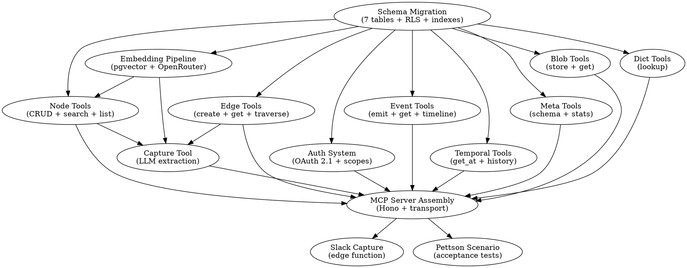

# RESONANSIA-MCP-SERVER — GEN 0 SPEC

## META

```yaml
spec_version: gen0
purpose: seed-spec for AI expansion to attractor-grade production spec
target_methodology: strongdm/attractor + dark-factory
next_ai_task: expand each section to implementation-ready detail, resolve all [DECIDE], produce attractor-compatible spec suite (unified-client.md, coding-agent.md, attractor.md equivalent)
language: typescript on bun OR deno on supabase edge functions [DECIDE in gen1]
database: postgresql + pgvector (supabase hosted for gen1, self-hosted later)
transport: MCP Streamable HTTP (JSON-RPC 2.0)
auth: OAuth 2.1 with tenant-scoped tokens
license: [DECIDE] Apache 2.0 or BSL 1.1
```

## CONTEXT FOR NEXT AI

You are expanding a gen0 spec into a production-ready attractor spec suite. The system is a federated MCP server that exposes a 7-table knowledge graph as AI-agent-accessible infrastructure. Read all sections. Every [DECIDE] requires you to evaluate options, pick one, and document rationale. Every [EXPAND] requires you to produce implementation-level detail. Every [RESEARCH] requires web research before deciding.

### What exists already

Resonansia is a platform with a core data model designed for multi-tenant, bitemporal, event-sourced knowledge graphs. The 7-table schema exists as design. No MCP server exists yet. No running code for this component. The broader Resonansia system has been explored as: Swedish accounting system, prosocial platform, consolidation engine, AI agent infrastructure. This spec concerns ONLY the MCP server layer.

### What this competes with

| System | What it does | What it lacks |
|---|---|---|
| Graphiti/Zep | Temporal knowledge graph for agent memory, MCP server, group_id tenancy | No federation, no event sourcing, single-purpose (agent memory only), simple group_id != real multi-tenancy |
| Neo4j MCP | Graph database exposed via MCP, Cypher queries | No bitemporality, no built-in multi-tenancy, no event sourcing, generic |
| Open Brain (Nate Jones) | Personal semantic memory, Supabase+pgvector, MCP server, Slack capture | Single-user, flat table (no graph), no temporality, no tenancy, no federation |
| Mem0 | Graph-enhanced memory, managed service | Proprietary, no federation, no self-hosting |
| Anthropic Knowledge Graph Memory | Reference MCP implementation | JSON file, no production use |
| MCP Gateways (Bifrost, ContextForge, MintMCP) | Auth, routing, federation for MCP servers | Gateway only — no data model, no graph, no storage |

### Resonansia's unique combination (no existing product has all)

1. Generalized knowledge graph (not only agent memory)
2. Bitemporal data model (valid_time + transaction_time)
3. Event sourcing with full audit trail
4. Multi-tenancy as core design (tenant_id on every row, RLS)
5. Federation with granular access control
6. Schema-flexible (JSONB) but typed (labels table)
7. MCP server exposure ← THIS SPEC BUILDS THIS

---

## 1. DATA MODEL — THE 7 TABLES

This is the kernel. Everything else is surface over this.

### 1.1 Tables

```sql
-- [EXPAND] each table to full DDL with indexes, RLS policies, constraints
-- [EXPAND] add pgvector embedding column to nodes table
-- [EXPAND] add GIN indexes on JSONB columns

tenants (
  tenant_id UUID PK DEFAULT gen_random_uuid(),
  parent_tenant_id UUID FK tenants NULLABLE,  -- hierarchy
  tenant_name TEXT NOT NULL,
  tenant_config JSONB DEFAULT '{}',           -- feature flags, limits, settings
  created_at TIMESTAMPTZ DEFAULT now(),
  -- [EXPAND] add billing, plan, status fields
)

labels (
  label_id UUID PK,
  tenant_id UUID FK tenants NOT NULL,
  label_name TEXT NOT NULL,                    -- e.g. 'lead', 'booking', 'invoice', 'person'
  label_kind ENUM('node','edge','event') NOT NULL,
  label_schema JSONB DEFAULT '{}',             -- JSON Schema for validation of data fields
  label_config JSONB DEFAULT '{}',             -- display, behavior, permissions
  UNIQUE(tenant_id, label_name, label_kind)
)

nodes (
  node_id UUID PK,
  tenant_id UUID FK tenants NOT NULL,
  label_id UUID FK labels NOT NULL,
  node_data JSONB NOT NULL DEFAULT '{}',
  embedding VECTOR(1536) NULLABLE,             -- pgvector, populated async
  valid_from TIMESTAMPTZ NOT NULL DEFAULT now(),
  valid_to TIMESTAMPTZ DEFAULT 'infinity',     -- bitemporal: business time
  recorded_at TIMESTAMPTZ DEFAULT now(),       -- bitemporal: system time
  created_by UUID NOT NULL,                    -- user or agent identity
  is_deleted BOOLEAN DEFAULT false
)

edges (
  edge_id UUID PK,
  tenant_id UUID FK tenants NOT NULL,
  label_id UUID FK labels NOT NULL,
  source_node_id UUID FK nodes NOT NULL,
  target_node_id UUID FK nodes NOT NULL,
  edge_data JSONB DEFAULT '{}',
  valid_from TIMESTAMPTZ NOT NULL DEFAULT now(),
  valid_to TIMESTAMPTZ DEFAULT 'infinity',
  recorded_at TIMESTAMPTZ DEFAULT now(),
  created_by UUID NOT NULL,
  is_deleted BOOLEAN DEFAULT false,
  -- [EXPAND] consider: can edges cross tenants? if yes, how does RLS work?
  -- ANSWER: yes, cross-tenant edges are the federation mechanism.
  -- source and target may belong to different tenants.
  -- RLS must check that requester has access to BOTH endpoints.
)

events (
  event_id UUID PK,
  tenant_id UUID FK tenants NOT NULL,
  label_id UUID FK labels NOT NULL,
  event_data JSONB NOT NULL,
  related_node_ids UUID[] DEFAULT '{}',
  related_edge_ids UUID[] DEFAULT '{}',
  occurred_at TIMESTAMPTZ NOT NULL DEFAULT now(),  -- when it happened in reality
  recorded_at TIMESTAMPTZ DEFAULT now(),            -- when system learned about it
  created_by UUID NOT NULL,
  -- events are append-only. never updated. never deleted.
  -- this IS the audit trail.
)

blobs (
  blob_id UUID PK,
  tenant_id UUID FK tenants NOT NULL,
  content_type TEXT NOT NULL,
  blob_data BYTEA NOT NULL,
  related_node_id UUID FK nodes NULLABLE,
  created_at TIMESTAMPTZ DEFAULT now(),
  created_by UUID NOT NULL
)

dicts (
  dict_id UUID PK,
  tenant_id UUID FK tenants NOT NULL,
  dict_type TEXT NOT NULL,           -- e.g. 'currency', 'country', 'bas_account'
  dict_key TEXT NOT NULL,
  dict_value JSONB NOT NULL,
  valid_from TIMESTAMPTZ DEFAULT now(),
  valid_to TIMESTAMPTZ DEFAULT 'infinity',
  UNIQUE(tenant_id, dict_type, dict_key, valid_from)
)
```

### 1.2 Key design properties

- **Bitemporality**: every mutable entity has valid_from/valid_to (business time) + recorded_at (system time). Queries can ask "what was true then?" and "what did we know then?"
- **Event sourcing**: events table is append-only, immutable audit log. Every mutation to nodes/edges SHOULD also emit an event.
- **Multi-tenancy**: tenant_id on every row. RLS enforces isolation. No data leaks between tenants.
- **Schema flexibility**: node_data/edge_data are JSONB. labels.label_schema provides optional JSON Schema validation. System works with zero schema (fully dynamic) or strict schema (validated).
- **Federation**: cross-tenant edges + scoped auth tokens = controlled sharing. Tenant A's node can link to Tenant B's node if both tenants consent.

### 1.3 Embedding strategy

```
[EXPAND] detail the async embedding pipeline:
- on node create/update → queue embedding job
- embedding model: text-embedding-3-small via OpenRouter (1536 dims)
- input: concatenate label_name + JSON.stringify(node_data)
- store in nodes.embedding column
- create match_nodes function for cosine similarity search
- [DECIDE] embed edge_data too? probably not in gen1.
- [DECIDE] embed events? probably not in gen1.
```

---

## 2. MCP SERVER — TOOL DEFINITIONS

### 2.1 Transport

```
Protocol: MCP over Streamable HTTP
URL pattern: https://{host}/mcp
Auth: OAuth 2.1 Bearer token in Authorization header
Fallback: API key via ?key= query param (dev/simple mode)
JSON-RPC 2.0 for all messages
```

### 2.2 Tools (what agents CAN DO)

Each tool = one JSON-RPC method exposed via MCP tools/list and tools/call.

```yaml
# --- NODES ---

create_node:
  params:
    node_type: string          # label_name, e.g. "lead", "booking"
    data: object               # JSONB payload
    tenant_id: string?         # optional if token is single-tenant scoped
  returns: { node_id, node_type, data, created_at }
  side_effects:
    - inserts into nodes
    - emits event(type: "node_created", related_node_ids: [node_id])
    - queues embedding generation
  auth: requires write permission on node_type within tenant

get_node:
  params:
    node_id: string
    valid_at: datetime?        # bitemporal: point-in-time query
    include_edges: boolean?    # default false
    include_events: boolean?   # default false
  returns: { node_id, node_type, data, valid_from, valid_to, edges?, events? }
  auth: requires read permission on node's tenant + label

update_node:
  params:
    node_id: string
    data: object               # merged with existing via JSON merge patch
    valid_from: datetime?      # default now(); allows backdating with permission
  returns: { node_id, data, valid_from, previous_version_id }
  side_effects:
    - sets valid_to on previous version
    - inserts new version row
    - emits event(type: "node_updated")
    - queues re-embedding
  auth: requires write permission

delete_node:
  params:
    node_id: string
  returns: { deleted: true }
  side_effects:
    - sets is_deleted=true, valid_to=now() (soft delete)
    - emits event(type: "node_deleted")
    - does NOT delete edges (they become dangling, queryable for audit)
  auth: requires delete permission

search_nodes:
  params:
    query: string              # semantic search query
    node_types: string[]?      # filter by label
    tenant_id: string?
    threshold: float?          # cosine similarity threshold, default 0.5
    limit: int?                # default 10, max 100
    filters: object?           # JSONB field filters, e.g. { "status": "active" }
  returns: { results: [{ node_id, node_type, data, similarity }] }
  implementation: pgvector cosine similarity on nodes.embedding, filtered by RLS + params
  auth: requires read permission

list_nodes:
  params:
    node_type: string
    tenant_id: string?
    filters: object?
    sort_by: string?           # field in node_data, or "created_at"
    pagination: { cursor?, limit? }
  returns: { nodes: [...], next_cursor? }
  auth: requires read permission

# --- EDGES ---

create_edge:
  params:
    edge_type: string          # label_name
    source_node_id: string
    target_node_id: string
    data: object?
  returns: { edge_id, edge_type, source_node_id, target_node_id, data }
  side_effects:
    - inserts into edges
    - emits event(type: "edge_created", related_node_ids: [source, target], related_edge_ids: [edge_id])
  auth: requires write on edge_type + read on both endpoint nodes
  # CRITICAL: for cross-tenant edges, requires write scope on BOTH tenants

get_edges:
  params:
    node_id: string
    edge_types: string[]?
    direction: "outgoing" | "incoming" | "both"?  # default "both"
    include_node_data: boolean?  # default false, if true returns connected node data too
  returns: { edges: [{ edge_id, edge_type, source_node_id, target_node_id, data, connected_node? }] }
  auth: filtered by what requester can see

traverse:
  params:
    start_node_id: string
    path_pattern: string       # e.g. "lead -[contacted_via]-> campaign -[part_of]-> *"
    max_depth: int?            # default 3, max 10
    filters: object?           # applied at each hop
  returns: { paths: [{ nodes: [...], edges: [...] }] }
  auth: each node/edge in traversal filtered by permissions. invisible nodes = path terminates.
  # [EXPAND] define path_pattern syntax. keep simple. probably label-name based.

# --- EVENTS ---

emit_event:
  params:
    event_type: string         # label_name
    data: object
    related_node_ids: string[]?
    related_edge_ids: string[]?
    occurred_at: datetime?     # default now(). allows recording past events.
  returns: { event_id, event_type, occurred_at, recorded_at }
  side_effects:
    - inserts into events (append-only)
  auth: requires write permission on event_type

get_events:
  params:
    node_id: string?           # events related to this node
    event_types: string[]?
    time_range: { from?: datetime, to?: datetime }?
    limit: int?
    sort: "asc" | "desc"?      # default "desc" (newest first)
  returns: { events: [...] }
  auth: filtered by tenant + node access

get_timeline:
  params:
    node_id: string
    include_related: boolean?  # include events from connected nodes? default false
  returns: { timeline: [{ event_id, event_type, data, occurred_at, source }] }
  # chronological merge of: events mentioning this node + version history of node

# --- TEMPORAL ---

get_node_at:
  params:
    node_id: string
    valid_at: datetime         # business time point
    recorded_at: datetime?     # system time point (optional, for "what did we know then?")
  returns: { node_id, data, valid_from, valid_to, recorded_at }
  # returns the version that was valid at valid_at AND recorded before recorded_at

get_history:
  params:
    node_id: string
  returns: { versions: [{ data, valid_from, valid_to, recorded_at, created_by }] }
  # all versions, ordered by recorded_at desc

# --- BLOBS ---

store_blob:
  params:
    data: string               # base64 encoded
    content_type: string
    related_node_id: string?
  returns: { blob_id, content_type, size_bytes }
  auth: requires write on tenant

get_blob:
  params:
    blob_id: string
  returns: { blob_id, content_type, data }  # data = base64

# --- DICTS ---

lookup_dict:
  params:
    dict_type: string
    key: string?               # if omitted, returns all entries of this type
    valid_at: datetime?        # temporal lookup
  returns: { entries: [{ key, value, valid_from, valid_to }] }

# --- SCHEMA/META ---

get_schema:
  params:
    tenant_id: string?
  returns: { 
    node_types: [{ label_name, label_schema, count }],
    edge_types: [{ label_name, label_schema, count }],
    event_types: [{ label_name, count }]
  }
  # agent uses this to understand what data model exists in a tenant

get_stats:
  params:
    tenant_id: string?
  returns: {
    total_nodes, total_edges, total_events,
    nodes_by_type: { [type]: count },
    recent_activity: [{ event_type, count, last_occurred_at }]
  }

# --- CAPTURE (Open Brain pattern) ---

capture_thought:
  params:
    content: string            # free-text input
    source: string?            # "slack", "claude", "manual", etc.
    tenant_id: string?
  returns: { node_id, extracted_type, extracted_data, extracted_entities }
  implementation:
    1. call LLM (gpt-4o-mini via OpenRouter) to extract:
       - type classification (from available labels in tenant)
       - structured data fields
       - mentioned entities (people, orgs, concepts)
       - action items
    2. create_node with extracted data
    3. for each mentioned entity: find-or-create node, create edge
    4. emit event(type: "thought_captured")
  # This is the "Open Brain" pattern but backed by full graph model.
  # [EXPAND] define the LLM prompt for extraction. make it label-aware.
```

### 2.3 Resources (what agents CAN READ)

```yaml
resonansia://tenants:
  description: list of tenants accessible to current token
  returns: [{ tenant_id, tenant_name, role }]

resonansia://schema/{tenant_id}:
  description: full data model of tenant (labels, counts)
  returns: same as get_schema tool

resonansia://node/{node_id}:
  description: full node with edges and recent events
  returns: node + edges + last 20 events

resonansia://stats/{tenant_id}:
  description: dashboard-level statistics
  returns: same as get_stats tool
```

### 2.4 Prompts (domain-specific instructions)

```yaml
analyze_entity:
  description: "Given a node and its connections, summarize current state and identify patterns"
  params: { node_id: string }
  implementation: fetch node + edges + events, compose analysis prompt

find_connections:
  description: "Find and explain the path between two entities"
  params: { node_a_id: string, node_b_id: string }

temporal_diff:
  description: "Compare entity state at two points in time"
  params: { node_id: string, time_a: datetime, time_b: datetime }
```

---

## 3. AUTH MODEL

### 3.1 Token structure

```yaml
# OAuth 2.1 JWT claims
{
  "sub": "user_or_agent_id",
  "iss": "resonansia",
  "aud": "resonansia-mcp",
  "scopes": [
    "tenant:TENANT_ID:read",
    "tenant:TENANT_ID:write",
    "tenant:TENANT_ID:nodes:LABEL:read",
    "tenant:TENANT_ID:nodes:LABEL:write",
    "tenant:TENANT_ID:edges:LABEL:read",
    "tenant:TENANT_ID:edges:LABEL:write",
    "tenant:*:read",                        # cross-tenant read (owner)
    "admin"                                  # full access
  ],
  "tenant_ids": ["TENANT_A", "TENANT_B"],   # quick lookup
  "exp": 1234567890
}
```

### 3.2 Permission resolution

```
For every tool call:
1. Extract tenant_id from params OR from token (if single-tenant)
2. Check token.scopes includes required scope for operation
3. If cross-tenant operation: check scopes for ALL involved tenants
4. RLS policies on database enforce even if server code has bugs
5. Every tool call → emit audit event with { caller, tool, params_hash, result_status }
```

### 3.3 Federation tokens

```
[EXPAND] define token issuance for:
- Internal users (Resonansia platform users)
- AI agents (service accounts with specific tool scopes)
- External partners (time-limited, auto-expiring, read-only by default)
- Cross-tenant tokens (for graph owners who span multiple tenants)

[DECIDE] token storage: JWT stateless vs opaque + introspection endpoint
recommendation: JWT for simplicity in gen1, introspection for gen2
```

---

## 4. FEDERATION ARCHITECTURE

### 4.1 Concept

Federation = controlled data sharing across tenant boundaries.

NOT: copying data between databases.
IS: cross-tenant edges + scoped tokens that allow queries to traverse boundaries.

### 4.2 Federation primitives

```
1. Cross-tenant edge: edge where source_node.tenant_id != target_node.tenant_id
   - requires write scope on both tenants
   - both tenant admins must consent (gen2: consent protocol)
   - gen1: manual token creation by platform admin

2. Virtual MCP endpoint: a dynamically composed MCP server that combines
   multiple tenants into one logical view.
   - owner of tenants A, B, C gets single MCP URL
   - search spans all three tenants
   - RLS still enforces per-node permissions
   - implementation: server resolves token.tenant_ids, queries across all

3. Partner endpoint: time-limited MCP URL for external partner
   - scoped to specific node_types and edge_types
   - read-only by default
   - all access logged in events table
   - auto-expires (token exp claim)
```

### 4.3 Implementation in gen1

```
gen1 scope:
- cross-tenant edges: YES (implement)
- virtual endpoints: YES (token with multiple tenant_ids → queries span all)
- partner tokens: YES (manual creation, read-only scopes)
- consent protocol: NO (defer to gen2)
- federated query forwarding to remote Resonansia nodes: NO (defer to gen3)
```

---

## 5. DEPLOYMENT

### 5.1 Gen1 target

```
Platform: Supabase
MCP server: Supabase Edge Function (Deno)
Database: Supabase Postgres with pgvector extension
Auth: Supabase Auth for users + custom JWT for agents
Embedding: OpenRouter API (text-embedding-3-small)
Metadata extraction: OpenRouter API (gpt-4o-mini)

[EXPAND] write exact supabase CLI commands for:
- project creation
- schema migration (all 7 tables)
- pgvector extension enable
- edge function creation and deployment
- secrets management (api keys)
- RLS policy creation

Model after: Open Brain guide structure (step-by-step, copy-paste)
But: with full 7-table schema instead of flat thoughts table
```

### 5.2 MCP server implementation structure

```
supabase/functions/resonansia-mcp/
├── index.ts              # Hono + @hono/mcp entry point
├── tools/
│   ├── nodes.ts          # create_node, get_node, update_node, delete_node, search_nodes, list_nodes
│   ├── edges.ts          # create_edge, get_edges, traverse
│   ├── events.ts         # emit_event, get_events, get_timeline
│   ├── temporal.ts       # get_node_at, get_history
│   ├── blobs.ts          # store_blob, get_blob
│   ├── dicts.ts          # lookup_dict
│   ├── meta.ts           # get_schema, get_stats
│   └── capture.ts        # capture_thought (LLM-powered extraction)
├── auth/
│   ├── middleware.ts      # token validation, scope extraction
│   └── scopes.ts         # permission checking logic
├── db/
│   ├── client.ts         # supabase client initialization
│   └── queries.ts        # parameterized SQL for all operations
├── embedding/
│   └── pipeline.ts       # async embedding via OpenRouter
└── deno.json             # imports: @hono/mcp, @modelcontextprotocol/sdk, hono, zod, @supabase/supabase-js

[EXPAND] each file to full implementation.
[RESEARCH] current exact versions of: @hono/mcp, @modelcontextprotocol/sdk, hono, zod, @supabase/supabase-js
```

### 5.3 Capture interface (Slack)

```
[EXPAND] same pattern as Open Brain:
- Slack app with bot token
- Separate edge function: supabase/functions/slack-capture/
- On message in designated channel:
  1. call capture_thought tool internally
  2. reply in thread with extracted type, entities, action items
- Use same LLM extraction pipeline as capture_thought tool

This is optional for gen1 but high-value for demo/dogfooding.
```

---

## 6. VALIDATION SCENARIO: PETTSON

Concrete scenario for acceptance testing. Real customer with multiple businesses.

```yaml
tenant_structure:
  - tenant: pettson_holding    # parent
    children:
      - taylor_events         # event production company
      - mountain_cabins       # cabin rentals
      - nordic_tickets        # ticket sales

node_types_per_tenant:
  taylor_events: [lead, campaign, event, venue, contact]
  mountain_cabins: [property, booking, guest, season]
  nordic_tickets: [match, ticket_batch, package, partner]

cross_tenant_edges:
  - package(nordic_tickets) --[includes]--> property(mountain_cabins)
  - campaign(taylor_events) --[sells]--> ticket_batch(nordic_tickets)
  - lead(taylor_events) --[also_booked]--> booking(mountain_cabins)

agent_roles:
  sales_agent:
    scopes: [tenant:taylor_events:read, tenant:nordic_tickets:read, tenant:mountain_cabins:read, tenant:taylor_events:nodes:lead:write]
    can: search leads across all tenants, create leads in taylor_events
    cannot: see financials, modify bookings

  content_agent:
    scopes: [tenant:taylor_events:nodes:campaign:write, tenant:taylor_events:nodes:campaign:read]
    can: create and edit campaigns
    cannot: see leads, access other tenants

  booking_agent:
    scopes: [tenant:mountain_cabins:write, tenant:nordic_tickets:read]
    can: create bookings, read ticket availability
    cannot: modify tickets, access taylor_events

  partner_travel_agency:
    scopes: [tenant:nordic_tickets:nodes:package:read, tenant:mountain_cabins:nodes:property:read]
    can: browse packages and properties
    cannot: see pricing, create anything, see internal data
    token_expiry: 30 days

acceptance_tests:
  - sales_agent calls search_nodes("football fans interested in cabin packages") → returns leads from taylor_events that have edges to mountain_cabins bookings
  - content_agent calls create_node(campaign, {...}) → succeeds in taylor_events
  - content_agent calls get_node(lead_id) → DENIED (no lead read scope)
  - booking_agent calls traverse(package_node, "package -[includes]-> *") → returns cabin properties across tenant boundary
  - partner calls create_node(...) → DENIED (read-only)
  - any mutation → event emitted with created_by = agent identity
  - get_node_at(lead_id, valid_at="2026-01-15") → returns lead data as it was on jan 15
  - get_timeline(lead_id) → chronological list: created, contacted, responded, booked
```

---

## 7. PRODUCTION PATH — ATTRACTOR MAPPING

### 7.1 How this maps to StrongDM attractor

```
attractor spec suite = three specs:

1. unified-llm-client.md → NOT NEEDED for this component
   (MCP server is consumed by arbitrary clients, not an LLM wrapper)

2. coding-agent.md → THIS IS THE FACTORY THAT BUILDS THE SERVER
   - the dark factory agent reads THIS spec
   - produces the MCP server code
   - uses Bun/Deno test runner for validation
   - acceptance tests = Pettson scenario above

3. attractor.md → THE PIPELINE DEFINITION
   - decompose into work units
   - each tool = one work unit
   - auth system = one work unit
   - schema migration = one work unit
   - embedding pipeline = one work unit
   - Slack capture = one work unit
   - Pettson validation = one work unit
```

### 7.2 Suggested attractor pipeline (DOT)



### 7.3 Dark factory instructions

```
The coding agent should:

1. Read this spec + expanded gen1 spec
2. Start with schema_migration: produce SQL, apply via supabase CLI
3. Build each tool module independently, with unit tests per tool
4. Assemble into MCP server with Hono framework
5. Deploy as Supabase edge function
6. Run Pettson acceptance tests
7. Build Slack capture as separate edge function

Shift work pattern:
- schema + individual tools = unattended (fully specified)
- MCP assembly + auth = may need human review (security-sensitive)
- Pettson validation = attended (may reveal spec gaps)

Pyramid summaries for each artifact:
- 2 words: what it is
- 8 words: what it does and how
- 32 words: full context including dependencies and constraints

Gene transfusion sources:
- Open Brain edge functions (Nate Jones) → capture pattern, Supabase edge function structure
- Graphiti MCP server → tool naming conventions, temporal query patterns
- AWS multi-tenant MCP sample → auth pattern, Cognito-style token scoping
```

---

## 8. GEN1 EXPANSION INSTRUCTIONS

The next AI (gen1) should produce:

```
1. FULL SQL MIGRATION FILE
   - all 7 tables with exact types, constraints, indexes
   - RLS policies for every table
   - pgvector setup
   - match_nodes function for semantic search
   - seed data for Pettson scenario

2. FULL TOOL IMPLEMENTATIONS
   - TypeScript for each tool in tools/ directory
   - Input validation with Zod schemas
   - Parameterized SQL queries (no string interpolation)
   - Error handling with MCP-compatible error codes
   - Unit tests per tool

3. AUTH IMPLEMENTATION
   - JWT validation middleware
   - Scope checking per tool
   - Token generation endpoint (or Supabase Auth integration)
   - RLS policy alignment with token scopes

4. MCP SERVER ASSEMBLY
   - Hono app with MCP transport
   - Tool registration
   - Resource registration
   - Health check endpoint

5. EMBEDDING PIPELINE
   - Async worker for embedding generation
   - OpenRouter API integration
   - Retry logic, rate limiting
   - match_nodes SQL function

6. CAPTURE TOOL
   - LLM prompt for metadata extraction
   - Entity find-or-create logic
   - Edge creation for mentioned entities

7. SLACK CAPTURE FUNCTION
   - Slack event subscription handler
   - Thread reply with extraction summary
   - Channel ID filtering

8. ACCEPTANCE TESTS
   - Pettson scenario as executable test suite
   - Each acceptance_test above = one test case
   - Test cross-tenant traversal
   - Test permission denial
   - Test temporal queries
   - Test event audit trail

9. DEPLOYMENT SCRIPT
   - supabase CLI commands for full setup
   - secrets configuration
   - environment variables
   - connection to Claude Desktop, ChatGPT, Claude Code

[CRITICAL] Every file must be complete, copy-paste deployable.
[CRITICAL] Follow Open Brain guide's principle: zero coding experience needed to deploy.
[CRITICAL] But: production-grade auth, not toy auth.
```

---

## 9. OPEN QUESTIONS FOR GEN1 TO RESOLVE

```
[DECIDE] Runtime: Supabase Edge Functions (Deno) vs standalone Bun server
  - Supabase: simpler deployment, free tier, no infra management
  - Bun: more control, better for heavy computation, needed for gen2+
  - Recommendation: Supabase for gen1, design for portability

[DECIDE] Embedding dimensions: 1536 (OpenAI default) vs 768 (smaller, faster)
  - 1536 = better quality, more storage
  - 768 = cheaper, faster, good enough for most use cases
  - Research: what does Graphiti use? what does Open Brain use?

[DECIDE] Cross-tenant edge consent: how does tenant B approve an edge from tenant A?
  - gen1: platform admin creates manually
  - gen2: consent protocol via events

[DECIDE] Event emission: synchronous (tool call waits) or async (fire-and-forget)?
  - synchronous: simpler, guaranteed delivery
  - async: faster tool response, but events might lag
  - Recommendation: synchronous in gen1

[DECIDE] Label creation: who can create new labels (node_types, edge_types)?
  - tenant admin only? any user with write scope? auto-created on first use?
  - Recommendation: tenant admin creates labels. agents use existing labels.
  - capture_thought can suggest new labels but not create them.

[RESEARCH] Current MCP SDK versions and Hono MCP adapter API
[RESEARCH] Supabase Edge Function limits (execution time, memory, payload size)
[RESEARCH] pgvector performance at 10k, 100k, 1M nodes
[RESEARCH] OAuth 2.1 in MCP — exact spec requirements as of March 2026
```
